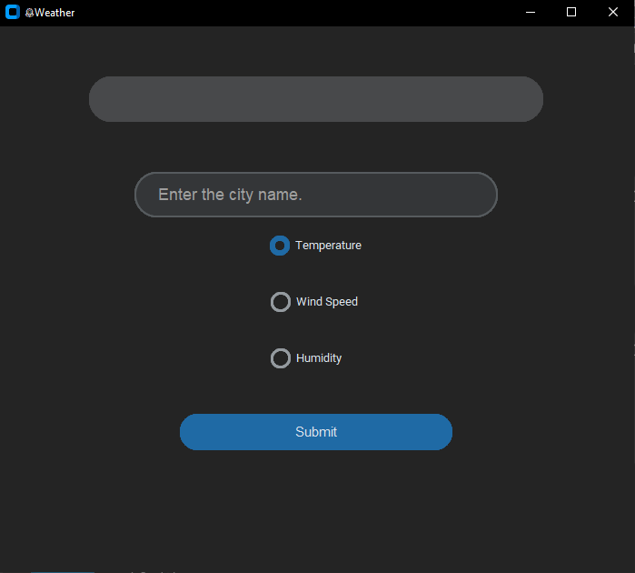
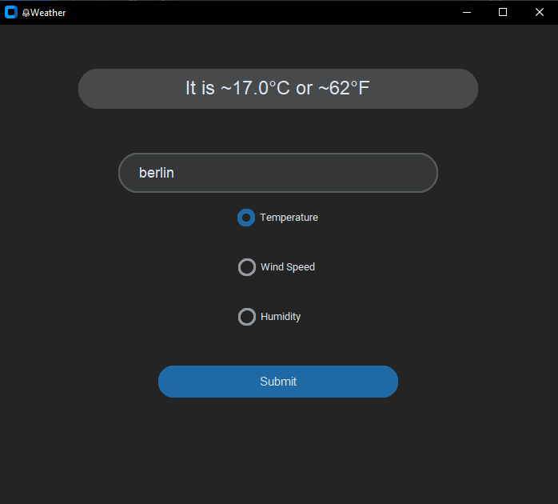

# 🌤️ Weather App
A simple Python windows desktop app that lets you search for a city and view its current weather.

## Features
* 🌡️ Temperature
* 💧 Humidity
* 💨 Wind speed
* 🔎 City search

## Made With
* Python
* CustomTkinter
* Requests
* Weather API (Open Mateo: https://open-meteo.com/)

* # .exe Window
* # Default


# Berlin Temperature


## Run
### Executable
Run `Weather-App.exe`.

### From Source
```bash
pip install requests customtkinter
python main.py
```

## Files
```text
Weather_Getter.py
main.py
Weather-App.exe
README.md
Empty-Screenshot.png
Temperature-Berlin.png
```
